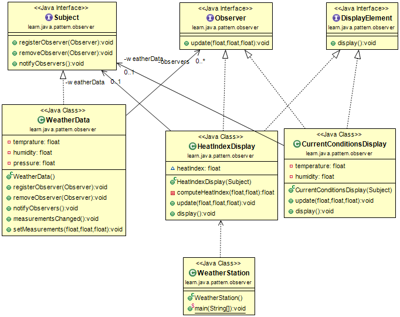
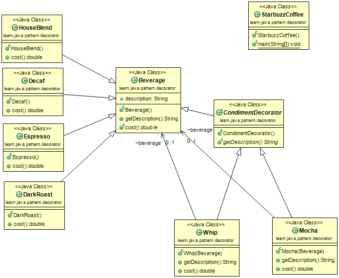
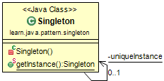
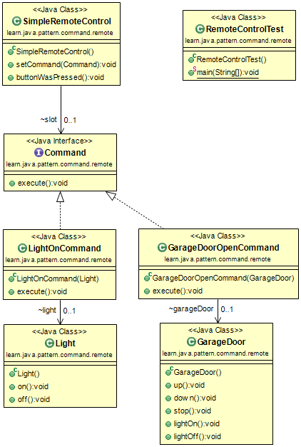

#Learning Java

## References:

Forked from [Parallel Processing and Multi-Core Utilization with Java](http://embarcaderos.net/2011/01/23/parallel-processing-and-multi-core-utilization-with-java/)

Forked from [Head First Design Patterns]
(https://github.com/bethrobson/Head-First-Design-Patterns)

## Design Patterns

### 1. 觀察者模式（Observer）

定義了物件之間的一對多關係，如此一來，當一個物件改變狀態，其他相依者都會收到通知並自動被更新。(p.51)

### 2. 裝飾者模式（Decorator）

動態地將  責任加諸於物件上，若要擴充功能，裝飾者提供了比繼承者更有彈性的選擇。(p.91)

### 3. 工廠模式（Factory）
 
#### 3.2 工廠方法（Factory Method）

定義了一個建立物件的介面，但由次類別決定要實體化的類別為何者。工廠方法讓類別把實體化的動作，交由次類別進行。(p.134)

#### 3.3 抽象工廠（Abstract Factory）

提供了一個介面，建立相關或相依物件之家族，而不需要明確指定具象類別。(p.156)

### 4. 獨體模式（Singleton）

確保一個類別只有一個實體，並給它一個存取的全域點 (global point)。(p.177)

### 5. 命令模式（Command）

將「請求」封裝成物件，以便使用不同的請求、佇列或者日誌，參數化其他物件。命令模式也支援可復原的作業。(p.207)

