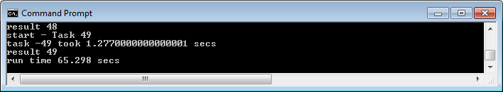
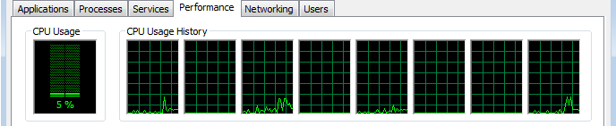

#Parallel Processing and Multi-Core Utilization with Java

[Origin](http://embarcaderos.net/2011/01/23/parallel-processing-and-multi-core-utilization-with-java/)

In order to harvest the full power of a multi-core processor the software application must be able to execute tasks in parallel utilizing all available CPUs. Parallelization of a process consist of breaking up a large single process into multiple smaller tasks that can run in parallel and once finalized can be combined obtaining an overall improvement in performance. The result is the execution of a single task or process by multiple processors or CPUs ***"Parallel Processing"***, not to be confused with ***concurrency***.

In this article I look into Java 6 and Java 7 concurrency libraries with the newly added Fork/Join support in the case of Java 7 to achieve asynchronous parallelization, improve performance and take advantage of a multi-core environment.

 1. [Java 6 Concurrency Library](#1)
 2. [The ```SerialTest``` class](#2)
 3. [The ```ExecutorServiceTest``` class](#3)
 4. [The ```CompletionServiceTest``` class](#4)
 5. [Implementing a call back to join the results: The ```CallBackTest``` class](#5)
 6. [Multi-Core utilization: Increasing the number of threads](#6)
 7. [Multi-Core utilization, thread pool size and load](#7)
 8. [Java 7 Fork/Join framework](#8)
 9. [Environment used](#9)


##<a name"1"></a>Java 6 Concurrency Library


So let’s first look at some of the option that Java 6 concurrency library offers.

Let’s start with a class that will be called from all test classes, this class will perform a task to give the process some load. The class called ```Task``` will implement ```Callable```. The call method will sleep for 1 second and then it will perform some task like concatenate a string a number of times. The idea is to simulate a task that first makes a call to a remote service and waits for a seconds for the call to return (this is the sleep) and then simulates some processing to the result like formatting or decoration (this is the loop that concatenates a string).

```java
import java.util.concurrent.Callable;
public class Task implements Callable {
   private int seq;
   public Task() {}
   public Task(int i) { seq = i; }

   public Object call() {
      String str = "";
      long begTest = new java.util.Date().getTime();
      System.out.println("start - Task "+seq);
      try {
         // sleep for 1 second to simulate a remote call,
         // just waiting for the call to return
         Thread.sleep(1000);
         // loop that just concatenate a str to simulate
         // work on the result form remote call
         for(int i = 0; i < 20000; i++)
            str = str + 't';
      } catch (InterruptedException e) {}
         Double secs = new Double((new java.util.Date().getTime() - begTest)*0.001);
         System.out.println("run time " + secs + " secs");
         return seq;
    }
}
```


##<a name"2"></a>The ```SerialTest``` class


Next I will introduce a class that will execute a task a number of times in a synchronous - serial mode and will display progress and time of execution; this way we will have the execution time to compare with other versions of the test that will use Java concurrent framework. We will start with 50 tasks to execute on every test.

```java
public class SerialTest {
   private static int NUM_OF_TASKS = 50;

   public SerialTest () {}

   public void run() {
      long begTest = new java.util.Date().getTime();
      Object taskResult;
      for(int i=0;i < NUM_OF_TASKS;i++) {
         Task task = new Task(i);
         taskResult = task.call();
         System.out.println("result "+taskResult);
      }
      Double secs = new Double((new java.util.Date().getTime() - begTest)*0.001);
      System.out.println("run time " + secs + " secs");
   }
   public static void main(String[] args) {
      new SerialTest().run();
      System.exit(0);
   }
}
```

image 1. Running SerialTest class shows this result:



No surprise it takes 65 seconds since we executed 50 tasks and every task sleeps for 1 second plus the time it will take to concatenate 20K strings and all is executed serially. 

image 2. The Task Manager performance view while the SerialTest is running:



I am running the test in a 8 CPU box, the performance view shows a CPU usage of only 5% of the total CPU power combined, the view shows that 4 of the CPUs are idle and the other 4 have minimal activity with most likely one running our test and the other 3 performing some OS tasks. 


##<a name"3"></a>The ```ExecutorServiceTest``` class

    
Now we will write the first test class using Java 6 Concurrent framework classes. Since Java 5 executing tasks in parallel is much easier, there is no need to use threads directly. The introduction of the ```ExecutorService``` in the concurrent package make it easy to submit tasks and the service will execute them and hand us back a future object that we can use to test the progress and to obtain the result of a given executed task once it finishes. The ```ExecutorService``` will use threads internally to achieve parallelization and since the tasks are submitted we can also execute the tasks asynchronously, once all the tasks at hand are submitted we can move ahead in the main thread and do something else or just wait and monitor for the tasks that end to get the results making possible to achieve fork/join processing. 

```java
import java.util.ArrayList;
import java.util.List;
import java.util.concurrent.*;

public class ExecutorServiceTest {
   private static int NUM_OF_TASKS = 50;

   public ExecutorServiceTest() {}

   public void run() {
      long begTest = new java.util.Date().getTime();

      List< Future > futuresList = new ArrayList< Future >();
      int nrOfProcessors = Runtime.getRuntime().availableProcessors();
      ExecutorService eservice = Executors.newFixedThreadPool(nrOfProcessors);

      for(int index = 0; index < NUM_OF_TASKS; index++)
         futuresList.add(eservice.submit(new Task(index)));

         Object taskResult;
         for(Future future:futuresList) {
            try {
               taskResult = future.get();
               System.out.println("result "+taskResult);
         }
         catch (InterruptedException e) {}
         catch (ExecutionException e) {}
      }
      Double secs = new Double((new java.util.Date().getTime() - begTest)*0.001);
      System.out.println("run time " + secs + " secs");
    }

    public static void main(String[] args) {
       new ExecutorServiceTest().run();
       System.exit(0);
    }
}
```

image 3. Running ```ExecutorServiceTest``` class will show this result:


16.73 seconds! a 75% improvement over the ```SerialTest``` class result.

The ```ExecutorServiceTest``` class utilizes the ```ExecutorService``` to achieve this huge improvement so let's look closely how this is done: 


```java
int nrOfProcessors = Runtime.getRuntime().availableProcessors();
  ExecutorService eservice = Executors.newFixedThreadPool(nrOfProcessors);
```


The ```ExecutorService``` is initialized by callings the static method ```newFixedThreadPool``` from the ```Executors``` class, the ```Executor``` class is a factory class to create ```ExecutorService``` instances with initialized thread pools. The test uses the ```newFixedThreadPool``` that created a pool with a fixed number of threads that are reused. In this test the number of available processors is passed to the factory so the ```ExecutorService``` is created with as many threads in the pool as available processors.

image 4. The Task Manager performance view while the ```ExecutorServiceTest``` is running:


Using the ```ExecutorService``` to submit the 50 tasks for execution with a pool of 8 threads utilizes an average 60+% of the total power available utilizing all available processors and still leaving enough processing power (near 40%) for the OS and other processes. 

Now let's go back to the code and continue analyzing the concurrent implementation. The next snipped of code shows how the tasks are submitted to the ```ExecutorService```: 

```java
   for(int index = 0; index < NUM_OF_TASKS; index++)
      futuresList.add(eservice.submit(new Task(index)));
```

The newly created instance of Task is passed to the ```ExecutorService``` ```submit``` method and that call returns a handle to a ```Future``` interface that represents the result of an asynchronous operation. The future provides methods to check if the operation is completed and once is completed give us access to the result of the operation, in our test the result of the task. We add the futures returned to a list that we will use later to obtain the results. 

```java
    Object taskResult;
    for(Future future:futuresList) {
       try {
          taskResult = future.get();
          System.out.println("result "+taskResult);
       }
       catch (InterruptedException e) {}
       catch (ExecutionException e) {}
    }
```

In this last snipped loops the list of futures to obtain the results and display them, notice the use of the ```taskResult``` of type ```Object``` to obtain the returned value of the asyncronously processed task, the result can be casted to its returned type if needed. Also notice that future.get is called sequentially by looping the list of futures, since we submitted the task in order the results are received in the same order. This works fine in some cases but in cases where some tasks could take longer to executed than others the call to ```future.get``` will block the execution of the main thread until the tasks at hand represented by its future finishes, until then the call blocks waiting for the result. One way to solve this problem is to use ```future.isDone``` method and only call ```future.get``` method when ```future.isDone``` method returns true, else test another future in the list. 

With this implementation we improved our test quite a bit using the concurrent framework but we are left with the potential problem of blocking while getting the results. Instead of using ```future.isDone``` we are going to use a ```CompletionService``` class to solve this problem. 


##<a name"4"></a>The ```CompletionServiceTest``` class 


```java
import java.util.concurrent.*;

public class CompletionServiceTest {
   private static int NUM_OF_TASKS = 50;

   public CompletionServiceTest() {}

   public void run() {
      long begTest = new java.util.Date().getTime();

      int nrOfProcessors = Runtime.getRuntime().availableProcessors();
      ExecutorService eservice = Executors.newFixedThreadPool(nrOfProcessors);
      CompletionService < Object > cservice = new ExecutorCompletionService < Object > (eservice);

      for (int index = 0; index < NUM_OF_TASKS; index++)
         cservice.submit(new Task(index));

      Object taskResult;
      for(int index = 0; index < NUM_OF_TASKS; index++) {
         try {
            taskResult = cservice.take().get();
            System.out.println("result "+taskResult);
         }
         catch (InterruptedException e) {}
         catch (ExecutionException e) {}
      }
      Double secs = new Double((new java.util.Date().getTime() - begTest)*0.001);
      System.out.println("run time " + secs + " secs");
   }

   public static void main(String[] args) {
      new CompletionServiceTest().run();
      System.exit(0);
   }
}
```

image 5. Running ```CompletionServiceTest``` class will show this result:


Down to 16.21 seconds from 16.67 seconds, a minimal improvement and the reason is because all tasks do exactly the same and take about the same time but even under this scenario the ```CompletionService``` shows improvement in performance!

Notice that this time image 5 shows a larger console showing more of the results. Looking closely at the details shown in the console we can see that task 47 displayed result between tasks 43 and 44 and we can also see that task 47 took 2.544 secs that is less than the 2.667 secs that took task 44 to complete so the use of ```CompletionService``` gave the advantage of getting the tasks that completed first even if they were submitted later in the order. 

Let's take a look at the specific ```completionService``` code: 

```java
   ExecutorService eservice = Executors.newFixedThreadPool(nrOfProcessors);
   CompletionService < Object > cservice = new ExecutorCompletionService < Object > (eservice);

   Object taskResult;
   for(int index = 0; index < NUM_OF_TASKS; index++) {
      try {
         taskResult = cservice.take().get();
```

The ```CompletionService``` interface and the ```ExecutorCompletionService``` class provide us with a tool that we can use combined with an ```ExecutorService``` to decouple the execution and the results. We can use the ```CompletionService``` to get the next available future that finished processing regardless the order of submission to the ```ExecutorService```. The ```ExecutorCompletionService``` constructor takes an ```Executor``` as parameter, in our case an ```ExecutorService``` instance and what we get with the ```ExecutorCompletionService``` is basically a queue that returns the futures in the order that they complete. 

The ```CompletionServiceTest``` eliminates the problem of the main thread blocking when joining the results of the tasks but this implementation still holds the main thread until all tasks have finished. The next implementation will remove this limitation allowing the main thread (the one that run the *Test class) to do other work while the tasks are executed. 


##<a name"5"></a>Implementing a call back to join the results: The ```CallBackTest``` class


The call back implementation will pass the control to the task making it responsible for calling back with the result when it finishes executing. Our test class will only submit the tasks but no longer needs to wait for the results improving performance and allowing the main thread to move on and perform other work. 

A new task class, the ```CallBackTask``` class:

```java
import java.util.concurrent.Callable;

public class CallBackTask implements Callable {
    private CallBackTest callBackTest;
    private int seq;

    public CallBackTask() {}
    public CallBackTask(int i) { seq = i; }

    public Object call() {
       String str = "";
       long begTest = new java.util.Date().getTime();
       System.out.println("start - Task "+seq);
       try {
          // sleep for 1 second to simulate a remote call,
          // just waiting for the call to return
          Thread.sleep(1000);
          // loop that just concatenate a str to simulate
          // work on the result form remote call
          for(int index = 0; index < 20000; index++)
             str = str + 't';
       } catch (InterruptedException e) {}

       callBackTest.callBack(seq);

       Double secs = new Double((new java.util.Date().getTime() - begTest)*0.001);
       System.out.println("task -"+seq+" took " + secs + " secs");
       return null;
    }

    public void setCaller(CallBackTest callBackTest) {
       this.callBackTest = callBackTest;
    }

    public CallBackTest getCaller() {
       return callBackTest;
    }
}
```

The new task class performs the same work but implements the new accessor methods ```setCaller``` and ```getCaller```. The ```setCaller``` method is invoked from the test class passing its own reference to allow the task to call back when it is done. Notice that the 'call' method in the ```CallBackTask``` class no longer returns a value, instead it calls the method ```callBack``` from the instance reference set from the test class (set by the ```setCaller``` method). 

The ```CallBackTest``` class: 

```java
import java.util.concurrent.*;

public class CallBackTest {
   private static int NUM_OF_TASKS = 50;
   Object result;
   int cnt = 0;
   long begTest, endTest;

   public CallBackTest() {
      begTest = new java.util.Date().getTime();
   }

   public void callBack(Object result) {
      System.out.println("result "+result);
      this.result = result;
      if(++cnt == 50) {
         Double secs = new Double((new java.util.Date().getTime() - begTest)*0.001);
         System.out.println("run time " + secs + " secs");
         System.exit(0);
      }
   }

   public void run() {
      int nrOfProcessors = Runtime.getRuntime().availableProcessors();
      ExecutorService es = Executors.newFixedThreadPool(nrOfProcessors);
      for(int i = 0;  i < NUM_OF_TASKS; i++) {
         CallBackTask task = new CallBackTask(i);
         task.setCaller(this);
         es.submit(task);
         // at this point after submitting the tasks the
         // main thread is free to perform other work.
      }
   }

   public static void main(String[] args) {
      new CallBackTest().run();
   }
}
```

A method ```callBack``` is implemented in this new test class, this method is called by the tasks instances to call back the caller (```CallBackTest```) and hand back the result, there is a simple check in this method to know when the last result is received and terminate the process. The other important difference in the ```CallBackTest``` class is in the ```run``` method, notice that after the task object (```CallBackTask```) is instantiated the method ```setCaller``` is invoked passing ```this```, this is to pass a reference of the test instance to the task to allow the call back. 

image 6. With all the changes set let's take a look at how this new implementation performs:


The ```CallBackTest``` shows a little improvement in performance with the added advantage of being fully asynchronous. 


##<a name="6"></a>Multi-Core utilization: Increasing the number of threads


The CPU performance view showed a CPU usage of about 61% (image. 4) when we executed the concurrent implementation ```ExecutorServiceTest```, ```CompletionServiceTest``` and ```CallBackTest``` yielded similar CPU utilization. What could be done to use the CPU power in more efficient way and improve our performance? One easy way to achieve better performance will be to be able to use the other 40% of CPU power that was not used. For that we can increase the number of threads in the ```CallBackTest``` pool from 8 (number of available CPUs) to 50 (number of tasks to run). 

The next test of the ```CallBackTest``` class will set the fixed threads in the pool to 50.

```java
ExecutorService es = Executors.newFixedThreadPool(50);
```

image 7. ```CallBackTest``` with 50 threads in pool result:


Just under 11 seconds! in the console we can see that the tasks were taking about 10.9 secs to execute each but since we had as many threads in the pool as we had tasks to execute all executed in parallel. 

image 8. The CPU performance view:


The CPU usage shows that all CPU power is maxed out @ 100% while the ```CallBackTest``` class runs with 50 threads in the pool. 


##<a name="7"></a>Multi-Core utilization, thread pool size and load


Improvement in performance was obtained when the number of threads in the pool was increased from 8 to 50. With the task class used in this article it was possible to increase performance but this is not always the case. Finding out the optimal number of threads in the pool requires testing and fine tuning. If the task in this article was more processor intense and longer to execute other would have been the result when the threads in the pool were increased. I find that if the environment is dedicated a good starting point is a thread pool of the same size of available CPUs.

I ran three tests with the ```CompletionServiceTest``` class changing the number of threads and the pool size to show the state of the threads while executing.

image 9. Profiler view of the first test that submits 50 tasks and sets 8 threads in the pool.


With 8 CPUs and 8 threads each thread executes a task non-stop, the 8 threads state stays runnable (green) until the tasks are finished and then the threads go back to the pool and remain in waiting state (yellow) until they are assigned another task.

image 10. Profiler view of the second test that submits 8 tasks with a pool thread size of 8.


In this test the 8 threads are scheduled to execute one task each and since there are 8 available CPUs all stay in runnable state (green) non-stop until they all finished.

image 11. Profiler view of the last test showing the last 8 threads of the submitted 50 tasks with 50 threads in the pool.


The 50 tasks are scheduled at the same time assigned to the 50 threads, since there are only 8 available CPUs the threads are runnable (green) for a short period of time and then go into blocked state (red) showing contention between the threads. The threads use a time slice of the CPU and the process must perform context switching every time another thread goes from blocked to runnable state and that is an expensive operation. scheduling a high number or threads could have a negative effect in performance.


##<a name="8"></a>Java 7 Fork/Join framework 


I executed all test classes with Java 7 (jdk 1.7) and all results obtained were consistently same or better than the results with Java 6 (JDK 1.6) pointing to a possible optimization of the concurrent package. 

An important addition to the concurrent package in Java 7 is the Fork/Join. The last test will use the newly added classes just to show how it can be integrated with existing concurrent package classes. This is not a full implementation of the Fork/Join framework but just a test using the ```RecursiveTask``` and ```ForkJoinPool``` classes in conjunction with the ```Future``` class. 

A task implementation for ```ForkJoin```: The ```FJTask``` class: 

```java
import java.util.concurrent.RecursiveTask;
class FJTask extends RecursiveTask {
   private int seq;

   public FJTask(int n) { this.seq = n; }

   public Integer compute() {
      String str = "";
      long begTest = new java.util.Date().getTime();
      System.out.println("start - Task "+seq);
      try {
         Thread.sleep(1000);
         for(int index = 0; index < 20000; index++)
            str = str + 't';
      } catch (InterruptedException e) {}
      Double secs = new Double((new java.util.Date().getTime() - begTest)*0.001);
      System.out.println("run time " + secs + " secs");
      return seq;
   }
}
```

This is the implementation task to be used by the ```ForkJoinPoolTest```; it extends ```RecursiveTask``` and implements the method ```compute```.

The ```ForkJoinPoolTest``` class: 

```java
import java.util.ArrayList;
import java.util.List;
import java.util.concurrent.*;

public class ForkJoinPoolTest {

   public ForkJoinPoolTest() {}
   private static int numOfTasks = 50;

   public void run() {
      long begTest = new java.util.Date().getTime();

      List futuresList = new ArrayList();
      ForkJoinPool fjPool = new ForkJoinPool(numOfTasks);

      for(int index = 0; index < numOfTasks; index++)
         futuresList.add(fjPool.submit(new FJTask(index)));

      Object taskResult;
      for(Future future:futuresList) {
         try {
            taskResult = future.get();
            System.out.println("result ForkJoin "+taskResult);
         }
         catch (InterruptedException e) {}
         catch (ExecutionException e) {}
      }
      Double secs = new Double((new java.util.Date().getTime() - begTest)*0.001);
      System.out.println("run time " + secs + " secs");
   }

   public static void main(String[] args) {
      new ForkJoinPoolTest().run();
      System.exit(0);
   }
}
```

image 12. ```ForkJoinPoolTest``` with 50 threads in pool result:


Since this implementation uses the future.get to join the results it performs slightly slower than the ```CallBackTest``` implementation.

In my next post on this subject I will cover more in detail Java 7's Fork/Join framework.


##<a name="9"></a>Environment used:


All tests in this post executed on Windows 7 Enterprise 64bit. 

Java 6 test:

  - java version "1.6.0_20"
  - Java(TM) SE Runtime Environment (build 1.6.0_20-b02)
  - Java HotSpot(TM) 64-Bit Server VM (build 16.3-b01, mixed mode) 

Java 7 test:

  - java version "1.7.0-ea"
  - Java(TM) SE Runtime Environment (build 1.7.0-ea-b125)
  - Java HotSpot(TM) 64-Bit Server VM (build 20.0-b06, mixed mode)

